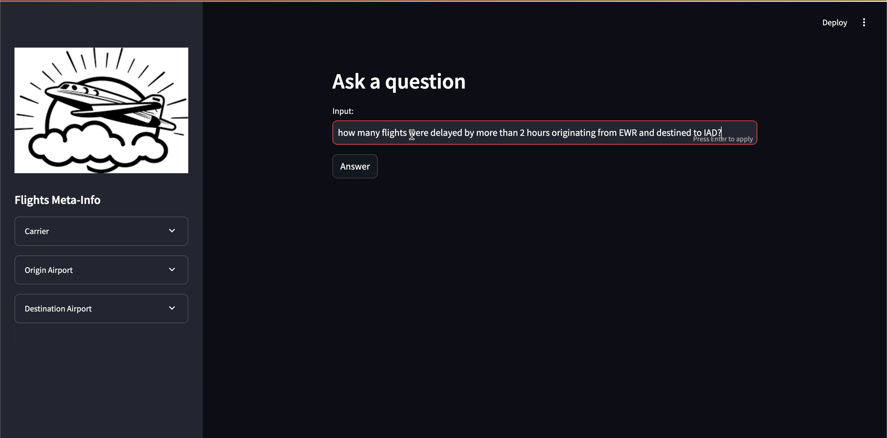

# genai-chat-with-sqlite
Using GenAI to interact with sqlite3 DB

## Steps to use/run the app
- create a venv
- pip install requirements.txt file
  - `pip install -r requirements.txt`
- run the app
  - `streamlit run app.py`
